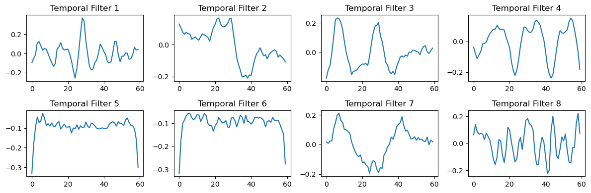

# fMRI Task State Classification with Deep Learning

A deep learning approach for classifying cognitive task states from fMRI time series data using a custom CNN architecture adapted from EEGNet for neuroimaging data, implemented in PyTorch.

## Overview

This framework implements a configurable classification system for fMRI task states.  

- `num_classes`: number of task categories in your dataset  
- `input_shape`: shape of your region × time × channel matrix (default `(214, 277, 1)`)

You can train on **any set of task labels**. For example, our demo dataset includes 6 tasks:

| Task Code | Task Name                  | Label |
|-----------|----------------------------|-------|
| PVT       | Psychomotor Vigilance Task | 0 |
| VWM       | Visual Working Memory      | 1 |
| DOT       | Dot Motion Task            | 2 |
| MOD       | Modular Task               | 3 |
| DYN       | Dynamic Task               | 4 |
| rest      | Resting State              | 5 |

## Sample Dataset Information

- **Input Dimensions**: `(214, 277, 1)` → (brain regions, time points, channels)
- **Architecture**: Custom CNN adapted from EEGNet for fMRI data
- **Performance**: ~84% balanced accuracy on validation set

## Usage Notes

1. **Input requirements**: Data must be structured as `(regions × time points × channels)` arrays in HWC format.  
   - Default: `(214, 277, 1)`  
   - Preprocessing (e.g., fMRIPrep) should be applied beforehand for artifact removal.  
2. **Subject-based splits**: Training and validation are split by subject IDs to prevent data leakage.  
3. **Modular architecture**: Choose between `fmriNet8`, `fmriNet16`, or `fmriNet32` depending on available compute and task complexity.  
4. **Custom constraints**: `ZeroThresholdConstraint` enforces sparsity in spatial filters.  
5. **Training setup**: Learning rate scheduling (halves every 200 epochs) and checkpointing are built-in.  
6. **Filter interpretation**: Learned temporal and spatial patterns can be visualized for interpretability.  

## Quick Start

### 1. Environment Setup

```bash
# Create and activate a new conda environment
conda create --name torch_fmri python=3.8
conda activate torch_fmri

# Install dependencies
pip install -r requirements.txt
```

### 2. Required Files

Ensure these files are in your project directory:
- `fMRINet/toy_dataframe.pkl` - Demo fMRI dataset (for testing)
- `fMRINet/dataframe.pkl` - Full fMRI dataset (contact author for access)
- `fMRINet/subjs.pickle` - Pre-defined subject splits
- `fMRINet/fMRINet_8.ipynb` - Main notebook
- `fMRINet/fMRINet_torch.py` - PyTorch model architecture definitions

### 3. Run the Analysis

Execute notebook cells sequentially for complete analysis pipeline.

## 📋 Step-by-Step Workflow

### Step 1: Data Loading and Preprocessing

```python
# Load pickled dataframe and subject splits
df = pd.read_pickle('dataframe.pkl')  # or 'toy_dataframe.pkl' for demo
with open('subjs.pickle', 'rb') as f:
    subjs = pickle.load(f)

# Split data by subjects (no data leakage)
train_df = df[df['subject'].isin(subjs[0:45])]
valid_df = df[df['subject'].isin(subjs[45:,])]
```

### Step 2: Data Transformation

```python
# Transform data to proper tensor format (HWC format for PyTorch)
train_data = np.dstack(train_df['Time_Series_Data'])
train_data = np.expand_dims(train_data, axis=0)
train_data = np.transpose(train_data, axes=[3, 2, 1, 0])
# Final shape: (batch, regions, time_points, channels) - HWC format
```

### Step 3: Class Balancing

```python
# Calculate balanced class weights for PyTorch
from sklearn.utils.class_weight import compute_class_weight
import torch

# Convert labels and compute weights
train_label_indices = np.argmax(train_label_t, axis=1)
weights = compute_class_weight(
    class_weight='balanced',
    classes=np.unique(train_label_indices),
    y=train_label_indices
)
class_weights = {int(cls): float(w) for cls, w in enumerate(weights)}
```

### Step 4: Model Architecture Selection

```python
# Choose from three available architectures
from fMRINet_torch import fmriNet8, fmriNet16, fmriNet32

# Default usage (demo dataset)
model = fmriNet8(num_classes=6, use_cuda=True)
# model = fmriNet16(num_classes=6, use_cuda=True)  # 16 temporal filters  
# model = fmriNet32(num_classes=6, use_cuda=True)  # 32 temporal filters

# Custom dataset (e.g., 200 regions × 300 time points × 1 channel, 4 tasks)
model = fmriNet8(num_classes=4, input_shape=(200, 300, 1), use_cuda=True)

# Display model summary
from torchsummary import summary
summary(model, input_size=(277, 214, 1))  # Note: torchsummary uses CHW format
```

### Step 5: Training Configuration

```python
# Setup PyTorch training components
import torch.nn as nn
import torch.optim as optim

# Loss function and optimizer
device = torch.device('cuda' if torch.cuda.is_available() else 'cpu')
model = model.to(device)

# Weighted loss for class imbalance
weights_tensor = torch.FloatTensor([class_weights[i] for i in range(len(class_weights))]).to(device)
criterion = nn.CrossEntropyLoss(weight=weights_tensor)

# Optimizer with weight decay
optimizer = optim.AdamW(model.parameters(), lr=0.001, weight_decay=0.0005)

# Learning rate scheduler
def lr_schedule(epoch):
    return 0.001 * np.power(0.5, np.floor(epoch/200))

# Custom checkpoint saver
class ModelCheckpoint:
    def __init__(self, filepath='./checkpoint.pth', save_best_only=True):
        self.filepath = filepath
        self.save_best_only = save_best_only
        self.best_val_acc = 0.0
        
    def save(self, model, optimizer, epoch, val_acc):
        if self.save_best_only:
            if val_acc > self.best_val_acc:
                self.best_val_acc = val_acc
                torch.save({
                    'epoch': epoch,
                    'model_state_dict': model.state_dict(),
                    'optimizer_state_dict': optimizer.state_dict(),
                    'val_acc': val_acc,
                }, self.filepath)
                return True
        return False

checkpointer = ModelCheckpoint()
```

### Step 6: Model Training

```python
# Training loop
from torch.utils.data import DataLoader, TensorDataset

# Convert data to PyTorch tensors (HWC format)
train_data_tensor = torch.FloatTensor(train_data).to(device)
train_label_tensor = torch.LongTensor(train_label_indices).to(device)
valid_data_tensor = torch.FloatTensor(valid_data).to(device)
valid_label_tensor = torch.LongTensor(valid_label_indices).to(device)

# Create data loaders
train_dataset = TensorDataset(train_data_tensor, train_label_tensor)
valid_dataset = TensorDataset(valid_data_tensor, valid_label_tensor)
train_loader = DataLoader(train_dataset, batch_size=64, shuffle=True)
valid_loader = DataLoader(valid_dataset, batch_size=64, shuffle=False)

# Training loop
epochs = 400
for epoch in range(epochs):
    # Training phase
    model.train()
    train_loss = 0.0
    train_correct = 0
    
    for data, target in train_loader:
        optimizer.zero_grad()
        output = model(data)  # HWC format input
        loss = criterion(output, target)
        loss.backward()
        optimizer.step()
        
        train_loss += loss.item()
        pred = output.argmax(dim=1)
        train_correct += pred.eq(target).sum().item()
    
    # Validation phase
    model.eval()
    val_loss = 0.0
    val_correct = 0
    
    with torch.no_grad():
        for data, target in valid_loader:
            output = model(data)
            loss = criterion(output, target)
            val_loss += loss.item()
            pred = output.argmax(dim=1)
            val_correct += pred.eq(target).sum().item()
    
    # Calculate metrics and save checkpoint
    train_acc = train_correct / len(train_dataset)
    val_acc = val_correct / len(valid_dataset)
    checkpointer.save(model, optimizer, epoch, val_acc)
    
    # Update learning rate
    if epoch % 200 == 0 and epoch > 0:
        new_lr = lr_schedule(epoch)
        for param_group in optimizer.param_groups:
            param_group['lr'] = new_lr
```

### Step 7: Evaluation and Visualization

```python
# Load best weights and evaluate
checkpoint = torch.load('./checkpoint.pth', map_location=device)
model.load_state_dict(checkpoint['model_state_dict'])
model.eval()

# Make predictions
with torch.no_grad():
    logits = model(valid_data_tensor)
    preds = torch.softmax(logits, dim=1).cpu().numpy()
    y_pred = np.argmax(preds, axis=1)
    y_true = valid_label_indices

# Calculate balanced accuracy
from sklearn.metrics import balanced_accuracy_score
balanced_accuracy = balanced_accuracy_score(y_true, y_pred)
print(f"Balanced Accuracy: {balanced_accuracy:.4f}")
```

## 🏗️ Model Architecture Details


### Network Structure (PyTorch Implementation)
```
Input: (214, 277, 1) - HWC Format
    ↓
Dropout(0.25)
    ↓
HWCConv2D(8, (1,60)) - Temporal Filtering (SAME padding)
    ↓
Permute → HWCConstrainedConv2D - Spatial Processing (VALID padding)
    ↓
HWCBatchNorm → ReLU → HWCAvgPool2D
    ↓
HWCSeparableConv2D(64) - Feature Extraction (SAME padding)
    ↓
HWCBatchNorm → ReLU → HWCAvgPool2D
    ↓
Flatten → Linear(6) → Logits
```

### Key Components

1. **ZeroThresholdConstraint**: Custom constraint for sparsity (threshold=7e-3 for PyTorch)
2. **HWC Format**: Custom layers that work directly with Height-Width-Channel format
3. **TensorFlow-like Behavior**: Exact replication of TensorFlow's padding and operations
4. **Balanced Class Weights**: Handles dataset imbalance using weighted CrossEntropyLoss

### PyTorch-Specific Features
- **HWC Format Support**: Custom layers maintain TensorFlow-like data format
- **GPU Acceleration**: Automatic CUDA detection and device placement
- **Memory Efficient**: Optimized tensor operations for large fMRI datasets
- **Checkpoint System**: Save/load model states with optimizer information

### Model Parameters
- **Total Parameters**: ~11,558 (varies slightly due to PyTorch implementation)
- **Trainable Parameters**: ~11,366
- **Input Format**: (B, H, W, C) where B=batch, H=214, W=277, C=1

## Results

- **Validation Accuracy**: ~83-84%
- **Balanced Accuracy**: ~84%
- **Final Validation Loss**: ~0.55

## 🔍 Filter Visualization

The notebook includes PyTorch-specific visualization of learned filters:

### Temporal Filters Visualization
```python
# Extract temporal filters (8 filters of length 60)
model.eval()
with torch.no_grad():
    w = model.conv1.conv.weight.detach().cpu().numpy()  # (8, 1, 1, 60)
    w = w[:, 0, 0, :]  # (8, 60)

fig, axes = plt.subplots(2, 4, figsize=(12, 4))
axes = axes.ravel()
for i in range(8):
    axes[i].plot(w[i])
    axes[i].set_title(f"Temporal Filter {i+1}")
```

### Spatial Filters Visualization
```python
# Extract spatial filters (32 filters organized as 8×4)
model.eval()
with torch.no_grad():
    W = model.depthwise_conv.conv.weight.detach().cpu().numpy()  # (32, 1, 1, 214)
    W = W[:, 0, 0, :].reshape(8, 4, 214).transpose(2, 0, 1)     # (214, 8, 4)

fig, axes = plt.subplots(8, 4, figsize=(8, 12))
for j in range(8):  # temporal filter index
    for k in range(4):  # spatial filter index
        ax = axes[j, k]
        ax.plot(W[:201, j, k])  # Plot first 201 spatial positions
        ax.set_title(f"T. Filter {j+1}, S. Filter {k+1}", fontsize=8)
```

**Temporal Filters** are visualized; 



**Spatial Filters** are visualized; 


## Important Note: 
The Results section and Filter Visualization were based on the actual dataframe.pkl, which contains the full dataset. In contrast, for methodological demonstration, we also introduced a toy_dataframe with a much smaller subset of the data to illustrate the workflow in a simplified way. The full analysis, however, was performed using the fMRI filter-based CNN architecture with the complete dataset.

## 📁 Project Structure

```
fMRI-PROJECT/
├── assets/                          # Project assets (figures & tables)
│   ├── images/                      # High-level tables and static diagrams
│   │   └── model_architecture_table.jpg   # Architecture summary table
│   └── plots/                       # Visualization outputs
│       ├── spatial_filters.png     # Learned spatial filter visualization
│       └── temporal_filters.png    # Learned temporal filter visualization
│
├── fMRINet/                         # Main project directory
│   ├── fMRINet_8.ipynb             # Main analysis notebook (PyTorch)
│   ├── fMRINet_torch.py          # PyTorch model architecture definitions
│   ├── checkpoint.pth               # Saved model checkpoint
│   ├── toy_dataframe.pkl           # Demo dataset (for testing)
│   ├── dataframe.pkl               # Full dataset - [Contact authors for access]
│   └── subjs.pickle                # Subject ID splits for reproducibility
│
├── requirements.txt                 # Python dependencies (PyTorch-based)
└── README.md                       # This file
```

## PyTorch Implementation Highlights

### Custom HWC Layers
This implementation features custom PyTorch layers that work directly with Height-Width-Channel (HWC) format:
- `HWCConv2d`: Convolution maintaining HWC format
- `HWCBatchNorm2d`: Batch normalization for HWC tensors
- `HWCAvgPool2d`: Average pooling preserving HWC layout
- `HWCTFSamePad2d`: TensorFlow-style SAME padding
- `HWCSeparableConv2d`: Separable convolution in HWC format

### Memory and Performance
- **GPU Optimization**: Automatic CUDA detection and efficient tensor operations
- **Batch Processing**: Optimized for mini-batch training with configurable batch sizes
- **Memory Efficient**: Custom layers minimize unnecessary tensor permutations

## Acknowledgments

This project adapts and extends the [EEGNet/EEGModels framework](https://github.com/vlawhern/arl-eegmodels) originally developed by Vernon J. Lawhern and colleagues at the Army Research Laboratory.  
Their work on CNN architectures for EEG classification provided the foundation for the temporal–spatial convolutional design used here, which we have customized for fMRI task-state classification and implemented in PyTorch with HWC format compatibility.