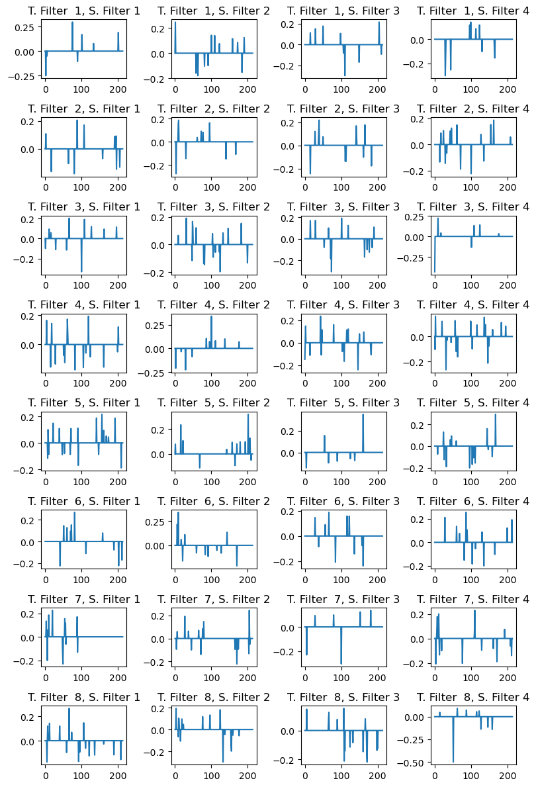

# fMRI Task State Classification with Deep Learning

A deep learning approach for classifying cognitive task states from fMRI time series data using a custom CNN architecture adapted for neuroimaging data.

## 🧠 Overview

This project implements a 6-class classification system for fMRI task states:

| Task Code | Task Name | Label |
|-----------|-----------|-------|
| **PVT** | Psychomotor Vigilance Task | 0 |
| **VWM** | Visual Working Memory | 1 |
| **DOT** | Dot Motion Task | 2 |
| **MOD** | Modular Task | 3 |
| **DYN** | Dynamic Task | 4 |
| **rest** | Resting State | 5 |

## 📊 Dataset Information

- **Input Dimensions**: `(214, 277, 1)` → (brain regions, time points, channels)
- **Total Subjects**: 58 subjects
- **Data Split**: 45 training subjects, 13 validation subjects
- **Architecture**: Custom CNN adapted from EEGNet for fMRI data
- **Performance**: ~84% balanced accuracy on validation set

## 🚀 Quick Start

### 1. Environment Setup

```bash
# Create conda environment
conda create --name tf python=3.8 anaconda 
conda activate tf
conda install tensorflow-gpu
```

### 2. Required Files

Ensure these files are in your project directory:
- `dataframe.pkl` - Main fMRI dataset
- `subjs.pickle` - Pre-defined subject splits
- `fMRI_net32.ipynb` - Main notebook

### 3. Run the Analysis

Execute notebook cells sequentially for complete analysis pipeline.

## 📋 Step-by-Step Workflow

### Step 1: Data Loading and Preprocessing

```python
# Load pickled toy_dataframe and subject splits
df = pd.read_pickle('toy_dataframe.pkl')
with open('subjs.pickle', 'rb') as f:
    subjs = pickle.load(f)

# Split data by subjects (no data leakage)
train_df = df[df['subject'].isin(subjs[0:45])]
valid_df = df[df['subject'].isin(subjs[45:,])]
```

### Step 2: Data Transformation

```python
# Transform data to proper tensor format
train_data = np.dstack(train_df['Time_Series_Data'])
train_data = np.expand_dims(train_data, axis=0)
train_data = np.transpose(train_data, axes=[3, 2, 1, 0])
# Final shape: (batch, regions, time_points, channels)
```

### Step 3: Class Balancing

```python
# Calculate balanced class weights
weights = sklearn.utils.class_weight.compute_class_weight(
    class_weight='balanced', 
    classes=unique_classes, 
    y=train_labels
)
```

### Step 4: Model Architecture

```python
# Custom CNN with temporal-spatial processing
inputs  = Input(shape = (214, 277, 1))
x       = Dropout(0.25)(inputs)
x       = Conv2D(8, (1, 60), padding = 'same', use_bias = False)(x)
x       = Permute((2, 1, 3))(x)
x       = DepthwiseConv2D((1, 214), use_bias = False,
                               depth_multiplier = 4,
                               depthwise_constraint = ZeroThresholdConstraint(threshold=0.01))(x)
x       = BatchNormalization()(x)
x       = Activation('relu')(x)
x       = Permute((2, 1, 3))(x)
x       = AveragePooling2D((1, 15))(x)
x       = Dropout(0.5)(x)

x       = SeparableConv2D(64, (1, 8), padding = 'same',
                               use_bias = False)(x)
x       = BatchNormalization()(x)
x       = Activation('relu')(x)
x       = AveragePooling2D((1, 4))(x)
x       = Dropout(0.5)(x)

features      = Flatten(name = 'flatten')(x)

dense         = Dense(6)(features)
softmax       = Activation('softmax', name = 'softmax')(dense)

```

### Step 5: Training Configuration

```python
# Setup training parameters
model.compile(
    loss='categorical_crossentropy',
    optimizer=AdamW(weight_decay=0.0005),
    metrics=['accuracy']
)

# Callbacks
checkpointer = ModelCheckpoint('/tmp/checkpoint.h5', save_best_only=True)
lr_schedule = lambda epoch: 0.001 * np.power(0.5, np.floor(epoch/200))
```

### Step 6: Model Training

```python
# Train the model
fittedModel = model.fit(
    train_data, train_label,
    batch_size=64,
    epochs=400, 
    validation_data=(valid_data, valid_label),
    callbacks=[checkpointer],
    class_weight=class_weights
)
```

### Step 7: Evaluation and Visualization

```python
# Load best weights and evaluate
model.load_weights('/tmp/checkpoint.h5')
preds = model.predict(valid_data)
balanced_accuracy = balanced_accuracy_score(
    np.argmax(valid_label, axis=1), 
    np.argmax(preds, axis=1)
)
```

## 🏗️ Model Architecture Details


### Network Structure
```
Input: (214, 277, 1)
    ↓
Dropout(0.25)
    ↓
Conv2D(8, (1,60)) - Temporal Filtering
    ↓
Permute → DepthwiseConv2D - Spatial Processing
    ↓
BatchNorm → ReLU → AveragePooling2D
    ↓
SeparableConv2D(64) - Feature Extraction
    ↓
BatchNorm → ReLU → AveragePooling2D
    ↓
Flatten → Dense(6) → Softmax
```

### Key Components

1. **ZeroThresholdConstraint**: Custom constraint for sparsity
2. **Temporal-Spatial Separation**: First temporal, then spatial processing
3. **DepthwiseConv2D**: Efficient spatial feature learning
4. **Balanced Class Weights**: Handles dataset imbalance

### Model Parameters
- **Total Parameters**: 11,558
- **Trainable Parameters**: 11,366
- **Non-trainable Parameters**: 192

## 📈 Results

- **Validation Accuracy**: ~83-84%
- **Balanced Accuracy**: ~84%
- **Final Validation Loss**: ~0.55

## 🔍 Filter Visualization

The notebook includes visualization of learned filters:

- **Temporal Filters**: 8 filters showing temporal patterns across time
- **Spatial Filters**: 32 filters (8×4) showing spatiotemporal patterns across brain regions


**Temporal Filters** are visualized; 


**Spatial Filters** are visualized; 




## Important Note: 
The results section and Filter Visualization considered with the actual dataframe.pkl which includes actual data; Considering overall methodology that performed with fMRI filter base CNN arhitecture we mentioned toy_dataframe that include pretty tiny amount of the data to provide to work on. 

## 📁 Project Structure

```
fMRI-PROJECT/
├── fMRINet/fMRINet_8.ipynb         # Main analysis notebook
├── fMRINet/toy_dataframe.pkl          # fMRI time series dataset
├── fMRINet/subjs.pickle               # Subject ID splits for reproducibility
└── README.md                  # This file

```


## 📁 Project Structure 
```markdown
fMRI-PROJECT/
├── fMRINet/assets/                       # Project assets (figures & tables)
│   ├── images/                   # High-level tables and static diagrams
│   │   └── model_architecture_table.jpg   # Architecture summary table as image
│   └── plots/                    # Visualization outputs
│       ├── spatial_filters.png   # Learned spatial filter visualization
│       └── temporal_filters.png  # Learned temporal filter visualization
│
├── fMRINet/fMRINet_8.ipynb               # Main analysis notebook
├── README.md                     # Project description and usage instructions
├── Requirements.txt              # Python dependencies
├── fMRINet/subjs.pickle                  # Subject ID splits for reproducibility
└── fMRINet/toy_dataframe.pkl             # Tiny demo dataset for quick tests (this is prefereed )
```

## 📝 Usage Notes

1. **Subject-based splits**: Prevents data leakage between train/validation
2. **Custom constraints**: ZeroThresholdConstraint enforces sparsity
3. **Learning rate scheduling**: Halves LR every 200 epochs
4. **Model checkpointing**: Automatically saves best performing model
5. **Filter interpretation**: Visualize learned temporal and spatial patterns

## Acknowledgments

This project adapts and extends the [EEGNet/EEGModels framework](https://github.com/vlawhern/arl-eegmodels) originally developed by Vernon J. Lawhern and colleagues at the Army Research Laboratory.  
Their work on CNN architectures for EEG classification provided the foundation for the temporal–spatial convolutional design used here, which we have customized for fMRI task-state classification.
